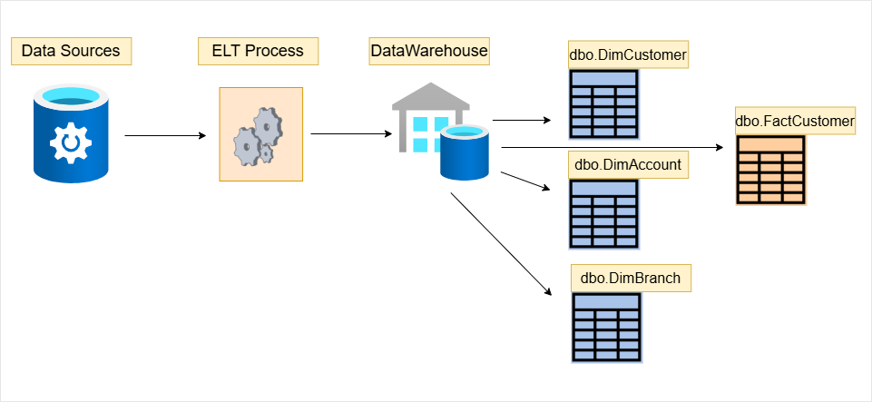
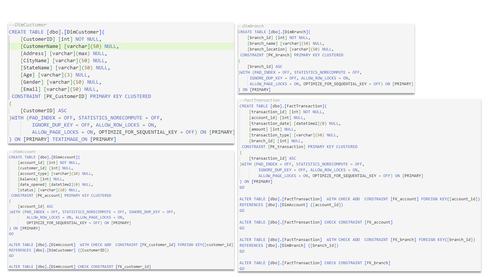
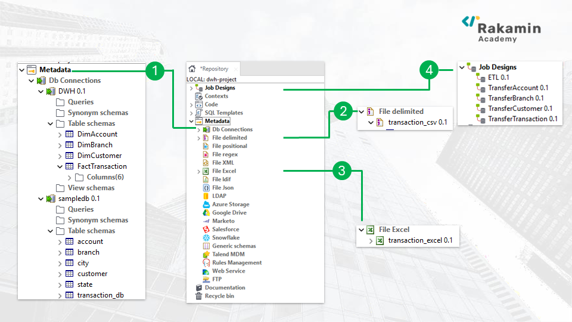
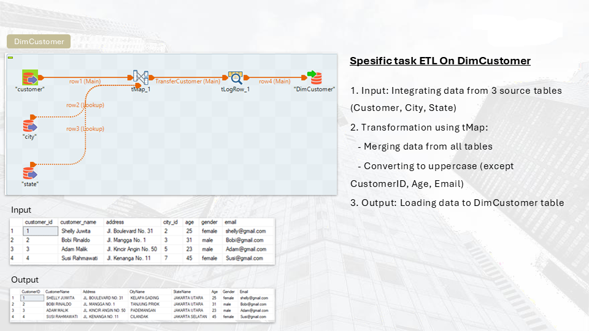
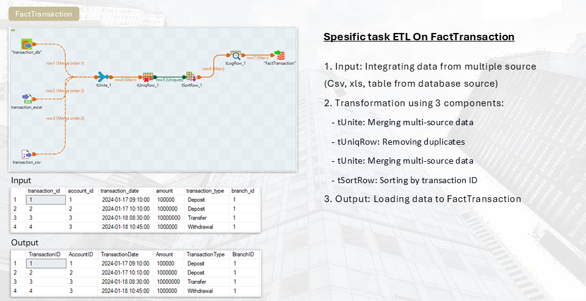
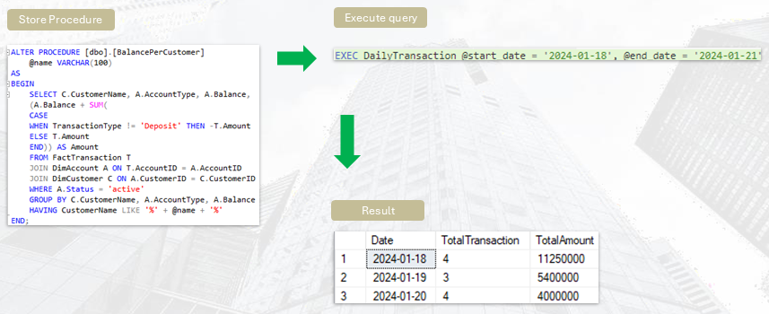
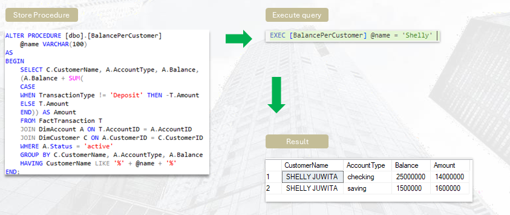

# Create Data Warehouse and Store Procedure

## About Company
Established in 2002, ID/X Partners (PT IDX Consulting) has been catering to businesses across Asia and Australia, spanning diverse sectors including financial services, telecommunications, manufacturing, and retail. Specializing in Data Analytic and Decisioning (DAD) solutions, complemented by risk management and integrated marketing expertise, ID/X Partners assists clients in optimizing portfolio profitability and streamlining business processes. With its comprehensive consulting services and technological solutions, ID/X Partners stands out as a one-stop service provider.

## Background
One of the clients of ID/X Partners operating in the banking industry has a need to establish a Data Warehouse from multiple data sources stored within their systems.

## Existing data resources
The various data resources include:
- transaction_excel (Excel file)
- transaction_csv (CSV file)
- transaction_db (SQL Server Database)
- account (SQL Server Database)
- customer (SQL Server Database)
- branch (SQL Server Database)
- city (SQL Server Database)
- state (SQL Server Database)

## Problem Statement
The main issue they encounter is the challenge of simultaneously extracting data from multiple sources (Excel, CSV, databases), which causes delays in their reporting and analysis workflows.

**Details of the workflow process**
- [1. Data Warehouse Creation](#1-data-warehouse-creation)
- [2. Create Setting for ETL Job](#2-Create-Setting-for-ETL-Job)
- [3. Create ETL Job for DimAccount Table And DimBranch Table](#3-Create-ETL-Job-for-DimAccount-Table-And-DimBranch-Table)
- [4. Create ETL Job for DimCustomer Table](#4-Create-ETL-Job-for-DimCustomer-Table)
- [5. Create ETL Job for FactTransaction Table](#5-Create-ETL-Job-for-FactTransaction-Table)
- [6. Create ETL Orchestration](#6-Create-ETL-Orchestration)
- [7. Create Store Procedure](#7-create-store-procedure)
-------------------------------------------------------------

### 1. Data Warehouse Creation
A data warehouse combines information from multiple sources into a unified database. This centralization allows the company to perform a more thorough analysis of its customer base. 
Evaluating data from various sources can provide insights into the company's performance.

Work Step: Create 3 dimension tables and 1 fact tables

### 2. Create Setting for ETL Job 

Explanations:
* 1 – **DB Connections:** Centralize and manage relational database connections to ensure consistency and enable reuse across multiple jobs.
* 2 – **File Delimited:**  Configure settings for delimited files like CSVs within the repository to streamline file handling in Talend jobs.
* 3 – **File Excel:** Store metadata configurations for Excel files in the repository, facilitating easier integration of Excel data into Talend jobs.
* 4 – **Job Designs:** Develop data integration workflows using Talend Studio to define and manage data processing tasks.

### 3. Create ETL Job for DimAccount Table And DimBranch Table

### 4. Create ETL Job for DimCustomer Table

### 5. Create ETL Job for FactTransaction Table

### 6. Create ETL Orchestration

### 7. Create Store Procedure

There are 2 Store Procedure created:
- **DailyTransaction:** Calculates the number of transactions and their total amounts for each day.

- **BalancePerCustomer:** Computes the remaining balance for each customer.

<!-- <a class="top-link hide" href="#top">↑</a>

<a href="#top">Back to top</a> -->